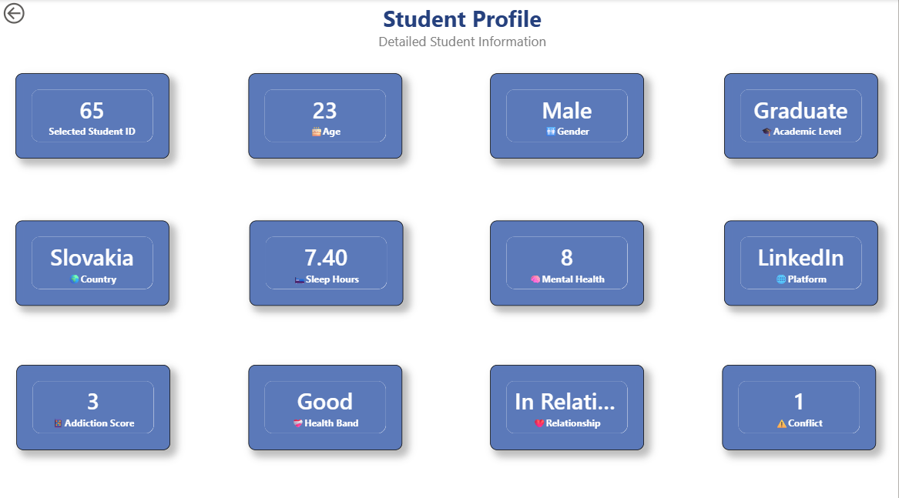
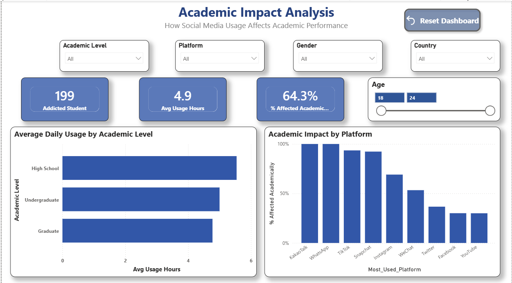
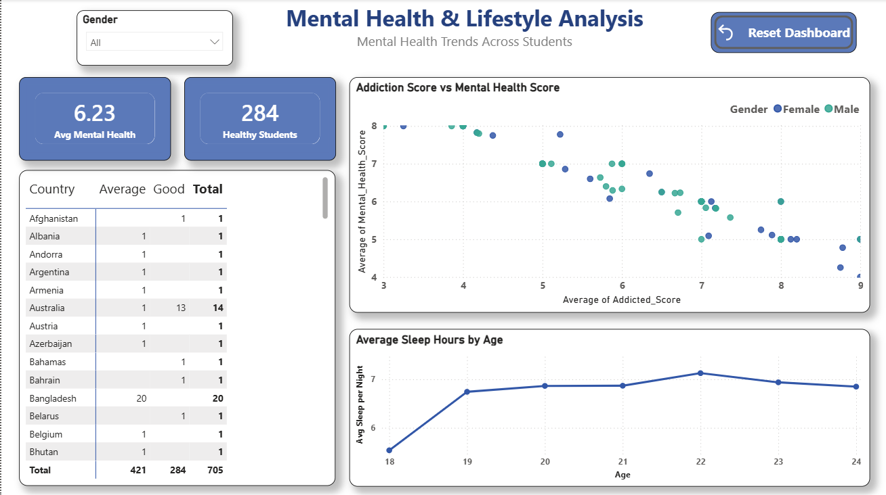

# 📊 Student Social Media Addiction Analysis

## 📌 Project Overview

This Power BI project analyzes students' social media usage and explores its relationship with:

- 📱 Social media usage
- 🧠 Mental health
- 😴 Sleep patterns
- 🎓 Academic performance
- ❤️ Relationship status
- ⚠️ Conflict levels
- 📊 Social media addiction

The dashboard provides interactive visualizations and KPIs to help understand how social media behavior may be associated with students' academic, mental-health, and lifestyle factors.

---

# 🎯 Project Objectives

The main objectives of this project are:

1. Analyze students' social media usage patterns.
2. Identify the most commonly used social media platforms.
3. Compare usage across genders and academic levels.
4. Analyze the relationship between social media usage and academic performance.
5. Study the relationship between addiction and mental health.
6. Analyze sleep patterns across different age groups.
7. Understand relationship status and conflict levels.
8. Create an interactive Power BI dashboard for data-driven insights.

---

# 📌 Key Dashboard KPIs

| KPI | Value |
|---|---:|
| 👥 Total Students | 705 |
| 📱 Average Usage Hours | 4.9 |
| 🎓 Academically Affected Students | 64.3% |
| 😴 Average Sleep Hours | 6.9 |
| 🧠 Average Mental Health Score | 6.23 |
| ❤️ Students in Relationship | 289 |
| 👤 Single Students | 384 |
| ⚠️ Medium Conflict Students | 450 |
| 🧑‍🎓 Addicted Students | 199 |
| 💚 Healthy Students | 284 |

---

# 📊 Dashboard Screenshots

## 1️⃣ 👤 Student Profile

The Student Profile page provides detailed information about an individual student.

### Student Information

- Student ID
- Age
- Gender
- Academic Level
- Country
- Sleep Hours
- Mental Health Score
- Most Used Platform
- Addiction Score
- Health Band
- Relationship Status
- Conflict Level



---

## 2️⃣ 📱 Social Media Usage Analysis

This interactive view compares social media usage across gender and academic level.

### Key Visuals

- Average Usage Hours by Gender
- Average Usage Hours by Academic Level
- Platform Preference by Gender
- Count of Students by Most Used Platform
- Gender-based comparison
- Academic-level comparison

The dashboard includes interactive navigation buttons to switch between Gender View and Academic Level View.


---

## 3️⃣ ❤️ Relationships & Conflicts Analysis

This dashboard analyzes students' relationship status and conflict levels.

### Key Visuals

- Total Students
- Students in Relationship
- Single Students
- Complicated Relationship Students
- Medium Conflict Students
- Student-level data table
- Conflict Level by Relationship Status
- Relationship Status Distribution

Interactive slicers allow analysis by:

- Relationship Status
- Conflict Level
- Gender
- Country


---

## 4️⃣ 🎓 Academic Impact Analysis

This page analyzes how social media usage is associated with students' academic performance.

### Key Visuals

- Addicted Students
- Average Usage Hours
- Percentage Academically Affected
- Average Daily Usage by Academic Level
- Academic Impact by Social Media Platform
- Age-based analysis

Interactive filters include:

- Academic Level
- Platform
- Gender
- Country
- Age



---

## 5️⃣ 🧠 Mental Health & Lifestyle Analysis

This dashboard explores the relationship between social media addiction, mental health, and sleep patterns.

### Key Visuals

- Average Mental Health Score
- Healthy Students
- Addiction Score vs Mental Health Score
- Average Sleep Hours by Age
- Country-wise student distribution
- Gender-based analysis



---

## 6️⃣ 🔍 Interactive Story View

The Interactive Story View allows users to explore and compare social media usage from different perspectives.

### Available Views

- 👩 Gender View
- 🎓 Academic Level View
- 📱 Platform Preference
- ⏱️ Average Usage Hours

Interactive navigation buttons allow users to move between different analytical views.


---

# 🔎 Key Insights

Based on the dashboard analysis:

### 📱 Social Media Usage

- Average daily social media usage is approximately **4.9 hours**.
- Instagram is the most commonly used platform among the students.
- Social media usage varies across different age groups.

### 🎓 Academic Performance

- Approximately **64.3% of students are academically affected**.
- High-school students show the highest average usage among the three academic levels.
- Social media usage can be compared across platforms to identify differences in academic impact.

### 🧠 Mental Health

- The dashboard shows a relationship between addiction scores and mental-health scores.
- Students with different addiction levels can be compared using the interactive visualizations.

### 😴 Sleep

- Average student sleep duration is approximately **6.9 hours**.
- Sleep patterns vary across different age groups.

### ❤️ Relationships & Conflicts

- **289 students** are in a relationship.
- **384 students** are single.
- **32 students** are categorized as having a complicated relationship status.
- Conflict levels can be analyzed according to relationship status.

---

# 🛠️ Tools & Technologies

### Power BI

Used for:

- Interactive dashboard development
- Data visualization
- KPI cards
- Slicers
- Interactive navigation
- Charts and tables

### Microsoft Excel

Used as the primary data source and for initial data preparation.

### Power Query

Used for:

- Data cleaning
- Data transformation
- Data type correction
- Preparing data for analysis

### DAX

Used for:

- KPI calculations
- Measures
- Aggregations
- Percentage calculations
- Analytical metrics

---

# 📈 Data Analysis Techniques

The project demonstrates the following data-analysis techniques:

- Data Cleaning
- Data Transformation
- Exploratory Data Analysis
- KPI Development
- Aggregation
- Percentage Analysis
- Comparative Analysis
- Trend Analysis
- Relationship Analysis
- Interactive Filtering
- Data Visualization

---

# 📂 Project Structure

```text
Student-Social-Media-Addiction/
│
├── Project_Nandan_Power_BI.pbix
├── README.md
│
├── Dashboard-Main.png
├── Student-Profile.png
├── Social-Media-Usage.png
├── Relationships-Conflicts.png
├── Academic-Impact.png
├── Mental-Health-Lifestyle.png
└── Interactive-Story-View.png
